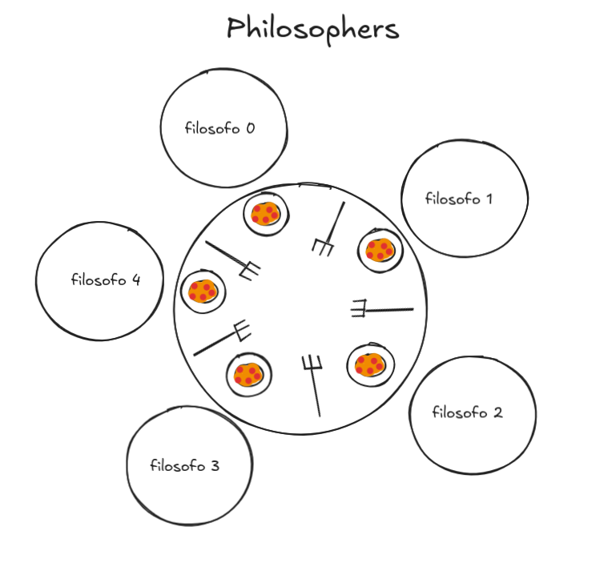

*Este projeto foi criado como parte do currículo da 42 por osousa-d.*


# Philosophers

## Descrição

O projeto **Philosophers (philo)** é um exercício clássico de programação concorrente baseado no problema do jantar dos filósofos.

- Imagine que você tem um número X de filósofos sentados a uma mesa.
- Cada filósofo traz **1 garfo** para a mesa e o deixa ao seu lado, ou seja, 1 garfo, 1 filósofo, 1 garfo, 1 filósofo...
- No entanto, para **comer**, o filósofo precisa de **2 garfos**, um garfo da esquerda e um da direita.
- Os filósofos podem realizar 4 ações:
    - **Pegar os garfos**
    - **Comer**
    - **Dormir**
    - **Pensar**

- O filósofo, após **comer**, precisa **dormir** para auxiliar a digestão, depois **pensa** e, em seguida, pode **comer** novamente, mas apenas com **dois garfos**.



- O desafio consiste justamente em manipular o tempo que os filósofos levam para executar ações usando **threads**.

- O que são **threads**?
Em termos simples, são **subprocessos** dentro de um **processo**.
Como cada filósofo executa as ações simultaneamente, o que os diferencia quando um **processo** (filósofo) está usando um garfo, tornando-o indisponível, é o **mutex**. Assim, quando um **processo** (filósofo) usa um **garfo**, ele bloqueia o **mutex** desse **garfo** e nenhum outro **processo** (filósofo) pode usar o mesmo garfo (lembrando que eles usam os garfos que estão próximos a eles).

- Nos dados de entrada do projeto, inserimos as seguintes informações:
    - **Número de filósofos** à mesa.
    - **Tempo até a morte** dos filósofos (em milissegundos), ou seja, se um filósofo ficar sem comer durante esse período, ele morrerá.
    - **Tempo para comer** (em milissegundos), ou seja, o tempo que o filósofo levará para comer.
    - **Tempo para dormir** (em milissegundos), o tempo que o filósofo passa dormindo.
    - **[Número de refeições]**, quantas vezes os filósofos precisam comer para se sentirem saciados (este dado é opcional).

---
### Detalhes da Implementação
Esta implementação utiliza:
- **Threads**, que são os filósofos.
- **Mutexes** para bloquear os processos bifurcados.
- **Duas Structs**
    - **t_philo** contendo todos os dados do filósofo individual:
        - **id** (indica se é o filósofo 1, 2, 3...);
        - **thread** (subprocesso a ser criado);
        - **last_meal_time** (horário da última refeição);
        - **meals_eaten** (quantas refeições foram feitas);
        - **philo_is_full** (para saber se todas as refeições foram feitas);
        - **meal_mutex** (mutex para as refeições do filósofo);
        - **left_fork** (ponteiro para o garfo esquerdo);
        - **right_fork** (ponteiro para o garfo direito);
        - **p_data** (ponteiro para a estrutura com todos os dados globais);

    - **t_data** Contém todos os dados globais:
        - **n_philo** (número de filósofos);
        - **time_to_die** (hora de morrer);
        - **time_to_eat** (hora de comer);
        - **time_to_sleep** (hora de dormir);
        - **times_a_philo_must_eat** (número de refeições que um filósofo deve fazer);
        - **time_start** (hora de início);
        - **print_mutex** (mutex para a instrução print que controla quem imprime o quê);
        - **death_mutex** (mutex para alterar a variável de morte);
        - **philos** (ponteiro para os filósofos);
        - **forks** (ponteiro para os forks);
        - **someone_died** (verifica se alguém morreu);

---
### Compilação

Na raiz do projeto, acesse a pasta "philo":
```bash
➜ philosophers git:(main) ✗ ls
philo README.md
➜ philosophers git:(main) ✗ cd philo
➜ philo git:(main) ✗ 
➜ philo git:(main) ✗ ls
inc Makefile obj philo src
```

Após entrar na pasta, digite o comando para gerar o executável do projeto:
```bash
make
```

Outros comandos:
| Comando | Descrição |
|---------|-----------|
| make clean | Limpa arquivos .o  |
| make fclean | Limpa arquivos .o e arquivos executáveis. |
| make re | Recompila tudo |
| make valgrind ARGS="input" | Verifica vazamentos de memória |

## Instruções ##

Após compilar o projeto, você deve executar o arquivo **philo** gerado com os seguintes argumentos:

```bash
./philo "<número de filósofos> <hora de morrer> <hora de comer> <hora de dormir> <argumento opcional [número de vezes que um filósofo precisa comer para se sentir satisfeito]>"
```
Exemplo:
```bash
./philo 3 410 200 200
```
or

```bash
./philo 3 410 200 200 3
```

Os argumentos não são passados ​​aleatoriamente, as seguintes entradas não são permitidas:

- Apenas o nome do programa;
- Cadeias vazias ou cadeias contendo apenas espaços;
- Argumentos que não sejam números;
- Um sinal (+ ou -) sem um número;
- Números negativos;
- Valores iguais a zero (para argumentos obrigatórios);
- Número incorreto de argumentos;
- Números maiores que o limite de um int (estouro de memória);
- Argumento opcional inválido (n_meals) ou menor ou igual a zero;

---
Após executar o programa com os argumentos, ele imprimirá as ações que cada filósofo está realizando:

```bash
➜ philo git:(main) ✗ ./philo 3 410 200 200 3
0 1 has taken a fork
0 1 has taken a fork
0 1 is eating
200 1 is sleepingsopher’s death must be displayed within 10 ms of
their actual de
200 2 has taken a fork
200 2 has taken a fork
200 2 is eating
200 3 has taken a fork
400 1 is thinking
400 1 has taken a fork
400 2 is sleeping
400 3 has taken a fork
400 3 is eating
410 1 died
```

O programa só termina quando um filósofo morre ou quando todos os filósofos terminam suas refeições (se especificado).

## Critérios de Avaliação ##
O projeto é avaliado com base em sua lógica e comportamento:

- Não pode travar, apresentar falha de segmentação ou entrar em um estado estranho.

- Um filósofo morre exatamente quando deveria. Se o tempo de entrada para a morte for de aproximadamente 400 ms e um filósofo morrer, deve haver um evento "morreu" exatamente em aproximadamente 400 ms.

- Valores consistentes, ou seja, ninguém morre "enquanto come".

- O programa não pode entrar em deadlock; todos os filósofos pegam apenas 1 garfo (isso trava o sistema, pois ninguém "soltará" o garfo até terminar de comer, mas só podem comer se tiverem 2 garfos).

- Todos os filósofos comem; ninguém é "esquecido" até morrer (de inanição).

- Impressões corretas; as mensagens não se misturam. Se alguém morrer, nada mais pode ser impresso depois de "morreu", ou se todas as mensagens estiverem "cheias", elas serão impressas da seguinte forma:
    - timestamp_in_ms X pegou um garfo
    - timestamp_in_ms X está comendo
    - timestamp_in_ms X está dormindo
    - timestamp_in_ms X está pensando
    - timestamp_in_ms X morreu

- Não deve haver condição de corrida (data race), que ocorreria quando um dos subprocessos acessa uma variável, mas, ao entrar na função, a variável possui um valor e, antes da função terminar, recebe outro valor de outro subprocesso (isso pode ser testado com o Helgrind).

- Não deve haver vazamentos de memória (isso é testado com o Valgrind).

- Outro teste interessante é verificar se, com a entrada, todos os filósofos têm a possibilidade de se alimentar até ficarem satisfeitos. A quantidade de refeições deve ser exatamente (número de filósofos * número de refeições) até que estejam satisfeitos. Isso pode ser testado com a seguinte entrada:

```bash
./philo <entrada> | grep eating | wc -l
```
Exemplo:
```bash
➜ philo git:(main) ✗ ./philo 2 800 200 200 5 | grep eating | wc -l
10
```
(2 * 5 = 10)

---

## Recursos ##
Utilizei o ChatGPT (https://chatgpt.com/) para me ajudar a compreender os conceitos de threads e mutexes, organizar o projeto (definindo os próximos passos) e depurar um problema de deadlock que estava enfrentando.
